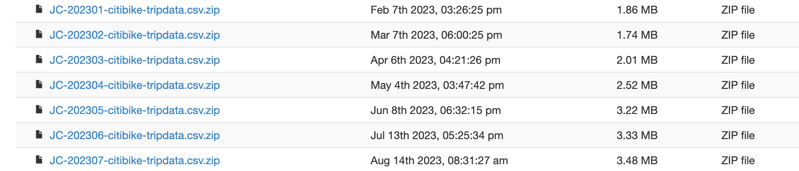

# RB_Module_18_Tableau

## Data Source

<https://citibikenyc.com/system-data>

Project location:<https://us-west-2b.online.tableau.com/#/site/joseeneas/projects/347577?:origin=card_share_link>
Alternate Path  :<https://us-west-2b.online.tableau.com/#/site/joseeneas/workbooks/729573?:origin=card_share_link>

All the project files can also be found here:

- RB_Module18_Tableau_Challenge (Workbook file)
- RB_Module18_Tableau_Challenge (PPT fil4 with screenshots)
- RB_Module18_Tableau_Challenge_PrepFlow
- RB_Module18_Tableau_Challenge_Package (Package version)

## Selection Criteria

- Use available months from the year 2023 (limited to 6)

- **January**
- **February**
- **March**
- **May**
- **June**

- Provided Data (Columns in each file)

  - Ride ID
  - Rideable type
  - Started at
  - Ended at
  - Start station name
  - Start station ID
  - End station name
  - End station ID
  - Start latitude
  - Start longitude
  - End latitude
  - End Longitude
  - Member or casual ride

- Visualizations
  - (1) Rides per Month, organized by month and week
  - (2) Rides per Member Type, organized by month and week
  - (3) Rides per hours, during summer
  - (4) Rides per hours, during winter
  - (5) Top 10 Start Stations
  - (6) Top 10 End Stations
  - (7) Average duration and distance
  - (8) Top 10 Start Stations, by ride count
  - (9) Top 10 End Stations, by ride count
  
- 6 dashboards
- 1 story

- Unexpected Phenomena
  - Visualization (1) indicates an odd phenomena, where the number of the rides plummets in every weekend. In certain cases the variation may be from tenths of thousands to less than one thousand.
  - Visualiztion (2) demonstrates a somewhat surprising behavior of both types of members. It would be safe to asume that the growth among members would be greater than among casual users.
  - Visualization (4) brings the surprise that people have almost the same utilization behavior during winter, as they have during summer.

- Worflow
  - Combine Files, using Tableau Prep Builder (file name: Tableau-Prep-Flow)
  - Create and analyze the visualizations, starting with the proposed questions, but not limited to those.
  - Create Dashbords
  - Create a table story based on the findings.

- Questions:

  - **How many trips have been recorded in total during the chosen period?** 444,073 rides in the first 6 months of 2023.
  - **By what percentage has total ridership grown?** It depends, there are positive variations indicating steady growth (like 2,475%), but also the same number, but negative (-96%)
  - **How have the proportions of short-term customers and annual subscribers changed?** It insteresting to observe that both types of membership behave in similar pattern along the months.
  - **What are the peak hours when bikes are used during the summer months?** Not surprisingly the morning rush hours and the afternoon rush hour, show the pick of utilization.
  - **What are the peak hours when bikes are used during the winter months?** Same as above, which only shows a surprise that even in winter people use bikes in the morning, possible to go to work.
  - **Today, what are the top 10 stations in the city for starting a journey?** Based on data why do you hypothesize these are the top locations?
  - **Today, what are the top 10 stations in the city for ending a journey? Based on data, why?** It is natural that the user will return to the same place as he/she pickup the bike.
  The top 10 starts and top 10 ends, indicate the validity of that hypothesis.
  - **How does the average trip duration change by the type of user? (This may be under "User Type" or "member_casual" depending on the period the data is from).**
  - **What is the average distance in miles for a bike trip?**

  The questions below cannot be addressed, as the data source does not contain the individual bike information.
  - **Which bikes (by ID) are most likely due for repair or inspection in the timespan?**
  - **How variable is the utilization by bike ID?**

  
